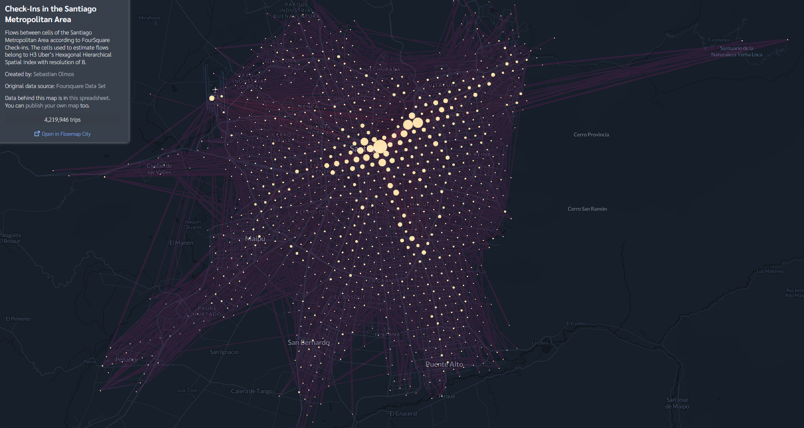

# Analysis and Visualization of Flows in Santiago from Foursquare Data

This repository contains code and data to produce the following visualization using http://flowmap.blue:

[Here you can see the visualization](https://www.flowmap.blue/1QqhqlwA40PzaRMocTy3BNq3djVLc-n6G5Gifwgeh0ew)

The following notebooks comprise this repository:

  * `00_shapefiles.ipynb`: define an area of interest (in the example, the Santiago Metropolitan Area) and download its boundaries from OpenStreetMap, using `osmnx`. Then, define a regular grid for analysis of these areas using the [H3](https://h3geo.org/) Uber’s Hexagonal Hierarchical Spatial Index.
  * `01_data_filtering.ipynb`: filter Foursquare data (see _Foursquare Data Set_ below) to analyze venues (places or Points of Interest) and check-ins in the area of interest. We do this using the `dask` library for parallel and out-of-core computation.
  * `02_flow_network.ipynb`: use the filtered data to build a network of places, and generate the input for the visualization.

Libraries we use in all notebooks include `pandas`, `geopandas`, `matplotlib`, and `seaborn`.

## Foursquare Data Set

The original data (the missing `4sq_2019` folder in the notebooks) can be downloaded from this source: https://sites.google.com/site/yangdingqi/home/foursquare-dataset 